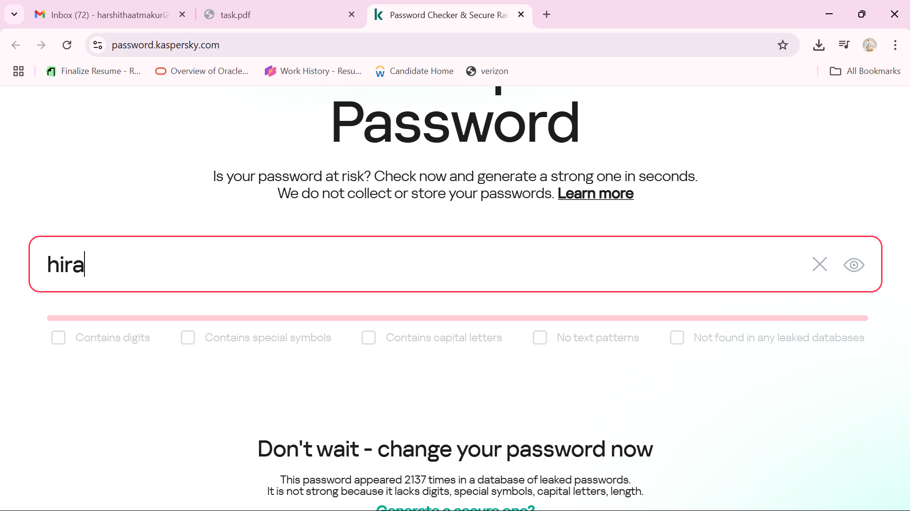
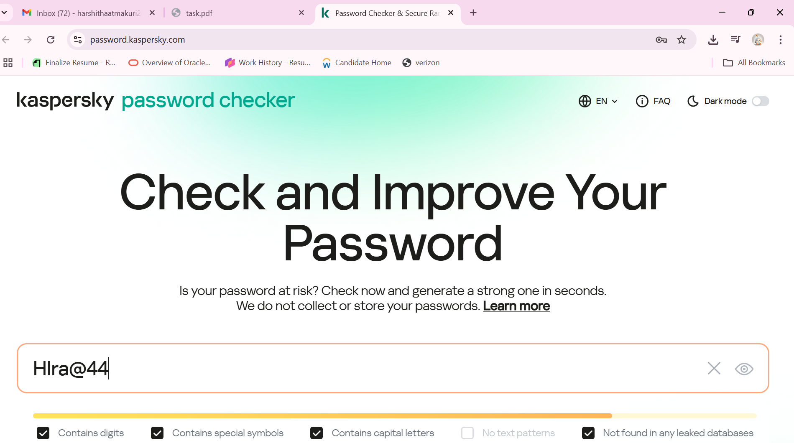
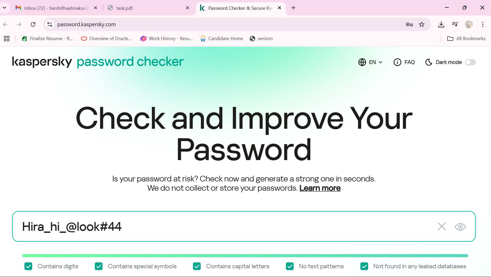

# 🔐 Password Strength Evaluation – Cybersecurity Internship Task 6

## ✅ Objective
To understand the factors that make a password strong, evaluate different passwords using an online strength checker, and summarize best practices for secure password creation.

---

## 🔍 Passwords Tested

| Password                | Strength       | Found in Leaks | Observations                                                  |
|-------------------------|----------------|----------------|---------------------------------------------------------------|
| `hira`                  | Very Weak ❌   | 2,086 times     | Common name, short, all lowercase letters                     |
| `hira44`                | Weak ⚠️        | 11 times        | Slightly stronger with digits, still short and predictable    |
| `Hlra@44`               | Medium ⚠️       | 0 times         | Mixed case + symbol + digit, but too short                    |
| `Hira_hi_@look#44`      | Strong ✅       | 0 times         | Long, complex, strong character mix, not in any leaked data   |

---

## 📸 Screenshots

### 1️⃣ Very Weak Password – `hira`

  
The password `hira` was found in leaked databases 2,086 times. It’s short, contains only lowercase letters, and offers extremely poor security.

---

### 2️⃣ Weak Password – `hira44`

  
The password `hira44` appeared in leaked databases 11 times. Including digits slightly improves strength, but it remains short and predictable.

---

### 3️⃣ Medium Password – `Hlra@44`

  
The password `Hlra@44` was not found in any known leaks. It contains uppercase letters, symbols, and digits, which improves its strength. However, its short length keeps it at medium security.

---

### 4️⃣ Strong Password – `Hira_hi_@look#44`

  
The password `Hira_hi_@look#44` was not found in any leaked databases. It is 16 characters long, uses uppercase and lowercase letters, digits, and symbols, and avoids predictable patterns, making it highly secure.

---

## 🧠 Key Learnings

### 🔒 What Makes a Password Strong?
- Minimum **12–16 characters**
- Includes:
  - Uppercase and lowercase letters
  - Numbers
  - Symbols (e.g., @, #, !)
- Avoids personal info or dictionary words
- Should not appear in leaked password databases

---

## 🛡️ Common Password Attacks

| Attack Type        | Description                                                                 |
|--------------------|-----------------------------------------------------------------------------|
| **Brute Force**    | Tries every possible combination of characters until it cracks the password |
| **Dictionary Attack** | Uses lists of common or leaked words to guess passwords quickly         |

---

## 🔐 Tools That Help Password Security

- **Password Managers** (e.g., Bitwarden, LastPass)
  - Securely store and generate strong passwords
- **Multi-Factor Authentication (MFA)**
  - Adds a second layer (OTP, biometric, etc.)

---

## 💡 Best Practices for Passwords

- Use a **passphrase** like: `BooksAreFun@2025!`
- Avoid using your name, birthday, or easy patterns
- Don’t reuse passwords across accounts
- Always enable MFA
- Use a password manager for convenience + security

---

## 📁 Files Included

- `README.md` – This report
- `1_very_weak.png` – Screenshot showing very weak password result
- `2_WEAK.png` – Screenshot showing weak password result
- `3_MEDIUM.png` – Screenshot showing medium password result
- `4_STRONG.png` – Screenshot showing strong password result

---

## 🔗 Tool Used

- [Kaspersky Password Checker](https://password.kaspersky.com)

---
